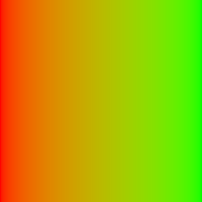
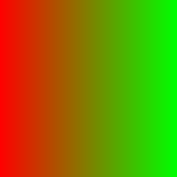

Color Gradients
###############

This page covers functions with the ``heman_color_`` prefix.

One-pixel tall images can be interpreted as `gradients`, also known as `lookup tables`.

Creating Gradients
==================

Clients can import a gradient using :c:data:`heman_import_u8`, or they can create one from scratch:

.. c:function:: heman_image* heman_color_create_gradient(int width, int num_colors, const int* cp_locations, const heman_color* cp_colors)

    Create a 1-pixel tall, 3-band image representing a color gradient that lerps
    the given control points.

   :param width: Desired number of entries in the lookup table.
   :type width: int
   :param num_colors: Number of control points.  Must be at least 2.
   :type num_colors: int
   :param cp_locations: The X coordinate of each control point.  The first value must be **0** and the last value must be **width - 1**.
   :type cp_locations: int*
   :param cp_colors: The RGB values of each control points.
   :type cp_colors: heman_color*

Gamma Correctness
=================

The following two images both depict the interpolation of **(1,0,0)** to **(0,1,0)**.  Can you tell which one is more correct?

The image on the left is more correct; it interpolates the colors by first unapplying gamma to the control point colors, then performing linear interpolation, then re-applying gamma.  Heman does this automatically when you call :c:data:`heman_color_create_gradient`, but the behavior can be controlled with the following function.

.. c:function:: void heman_color_set_gamma(float f)

    This sets some global state that affects lighting and color interpolation.
    The default value is **2.2**.

Applying Gradients
==================

.. c:function:: heman_image* heman_color_apply_gradient(heman_image* heightmap, float minheight, float maxheight, heman_image* gradient)

    Create a 3-band image with the same dimensions as the given heightmap by
    making lookups from a 1-pixel tall color gradient.  The heightmap values
    are normalized using the given minheight, maxheight range.
