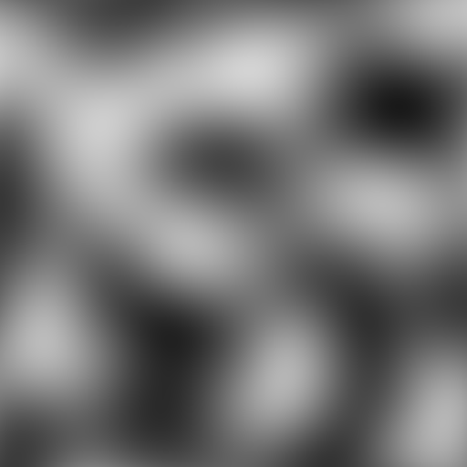
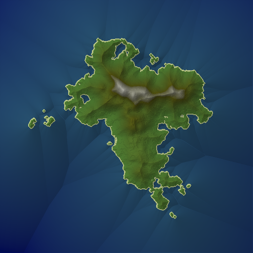
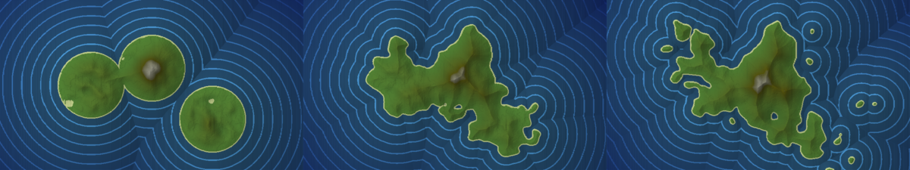
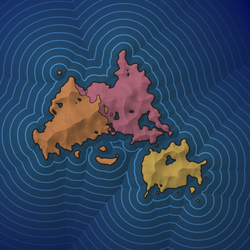

Terrain Generation
##################

All functions with the ``heman_generate_`` prefix are meant to help in the creation of interesting procedural imagery.

Noise and FBM
=============

The image on the left is Ken Perlin's simplex noise function, which is nice and continuous, but non-fractal.  The image on the right adds up several octaves of that same noise function; this is known as `Fractional Brownian Motion` (FBM).  This provides a way of generating fractal-like images that look cool when interpreted as a height map.

.. image:: _static/fbm.png
   :width: 240px

.. c:function:: heman_image* heman_generate_simplex_fbm(int width, int height, float frequency, float amplitude, int octaves, float lacunarity, float gain, int seed)

    Sums up a number of noise octaves and returns the result. A good starting point is to use `lacunarity` = 2.0, `gain` = 0.5, and `octaves` = 3.

Islands
=======

.. c:function:: heman_image* heman_generate_island_heightmap(int width, int height, int random_seed)

    High-level function that uses several octaves of simplex noise and a signed distance field to generate an interesting height map.

    Note that this function creates a "seed point" at the center of the image. To have control over the seed point, see :c:data:`heman_generate_archipelago_heightmap`.

Planets
=======

.. c:function:: heman_image* heman_generate_planet_heightmap(int width, int height, int random_seed)

    High-level function that sums up several octaves of `OpenSimplex <https://en.wikipedia.org/wiki/OpenSimplex_noise>`_ noise over a 3D domain to generate an interesting lat-long height map.  Clients should specify a `width` that is twice the value of `height`.

.. image:: _static/planet.png
   :width: 512px

Archipelagos
============

Heman proffers two high-level functions for generating archipelagos.  They are similar to :c:data:`heman_generate_island_heightmap` but more flexible, allowing the user to specify custom seed points.  The first function below generates only a height map; the latter can also generate "political" colors.

.. c:function:: heman_image* heman_generate_archipelago_heightmap(int width, int height, heman_points* points, float noiseamt, int random_seed)

    0.3 is a good choice for `noiseamt`, but 0 is useful for diagnostics, as seen in the leftmost panel below.

    `points` can be a list of two-tuples (X Y) or three-tuples (X Y Strength).

    The image below depicts the same archipelago using three different noise amounts.

.. c:function:: void heman_generate_archipelago_political(int width, int height, heman_points* points, const heman_color* colors, heman_color ocean, float noiseamt, int seed, heman_image** elevation, heman_image** political)

    This is a fancier API that generates political colors as well as elevation data.  Behind the scenes, it uses :c:data:`heman_distance_create_cpcf`.

